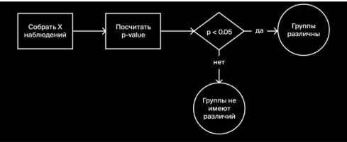
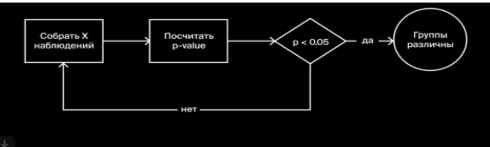
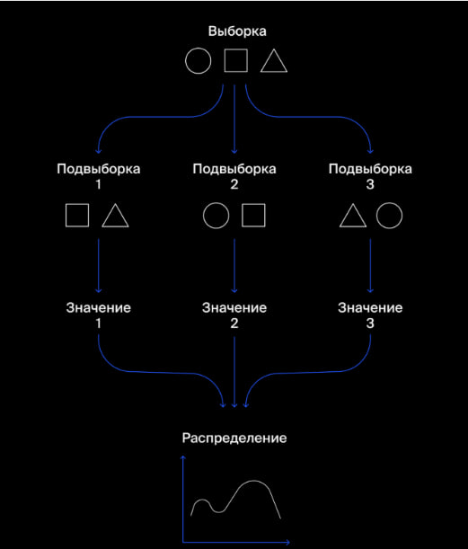

# СОДЕРЖАНИЕ
- [A/B-ТЕСТЫ](#a-b-тесты)
- [ДЛИТЕЛЬНОСТЬ ТЕСТА](#длительность-теста)
- [СРАВНЕНИЕ МЕТРИК](#сравнение-метрик)
- [ДОВЕРИТЕЛЬНЫЙ ИНТЕРВАЛ](#доверительный-интервал)
- [BOOTSTRAP](#bootstrap)
- [КОД PYTHON](#код-python)


# A/B-ТЕСТЫ

**A/B-тест** (сплит-тестирование) — техника проверки гипотез. Позволяет оценить, как изменение сервиса или продукта повлияет на пользователей.

- Аудиторию делят на две группы: **контрольную (A)** и **тестовую (B)**.
- Группа A видит начальный сервис, без изменений.
- Группа B получает новую версию, которую и нужно протестировать.

Эксперимент длится фиксированное время (например, две недели). В ходе тестирования собираются данные о поведении пользователей в разных группах. Если ключевая метрика в тестовой группе выросла по сравнению с контрольной — новую функциональность внедряют.

**A/A-тест** — проверка корректности, часто делают перед A/B-тестом. В нём пользователей делят на две контрольные группы, которые видят одинаковый сервис. Ключевая метрика у групп отличаться не должна: если она разная — ищите ошибку.

## Факторы, которые нужно учитывать при сравнении метрик A/B-теста

- **Время проведения теста.** Слишком долгий эксперимент тормозит запуск новой функциональности, а результаты слишком короткого могут быть недостоверными.
- **Уверенность, что разница между метриками не случайность** — особенно если разница низкая (p-value).
- **Разброс средних значений метрик** — как сильно метрики могут отклоняться (доверительный интервал).

## ДЛИТЕЛЬНОСТЬ ТЕСТА

**Проблема подглядывания:** общий результат искажается, если новые данные поступают в начале эксперимента.

Правильно: 


Неправильно:


> **Правило:** размер выборки всегда определяем заранее.

- [Онлайн-калькулятор для определения размера выборки](https://wingify.com/tools/ab-test-duration-calculator/).

## СРАВНЕНИЕ МЕТРИК

### Гипотезы

- **Нулевая гипотеза H0:** новая функциональность не улучшает метрики.
- **Альтернативная гипотеза H1:** новая функциональность улучшает метрики.

### Ошибки двух типов

- **Ошибка первого рода** — когда H0 верна, но отклоняется.
- **Ошибка второго рода** — когда H0 не верна, но принимается.

**P-value** показывает вероятность ошибки первого рода.

- Если p-value **больше** порогового значения — нулевую гипотезу отвергать не стоит.
- Если **меньше** — есть основание отказаться от нулевой гипотезы.

Общепринятые пороговые значения — **5%** и **1%**.

### Метод проверки через t-test

Средние значения сравнивают методами проверки односторонних гипотез с помощью `scipy.stats.ttest_ind()`.

**Почему `ttest_ind`, а не `ttest_rel`:**

- `ttest_rel` — когда есть пары измерений для одних и тех же объектов (например, один и тот же пользователь до и после).
- `ttest_ind` — когда объекты в двух группах разные и не связаны друг с другом (классический A/B-тест на сайте: старую версию сайта (группа A) показываем одним пользователям, а новую (группа B) — другим).

---

# ДОВЕРИТЕЛЬНЫЙ ИНТЕРВАЛ

**Проблема:** взяли выборку и получили выборочное среднее, равное 472. Это наша оценка среднего всей ГС, но насколько она точна? Может, случайно попалась выборка со средним, очень далёким от истинного среднего?

Случайность выборки вносит случайность и в оценку. Оценивает уверенность в оценке по выборке **доверительный интервал**.

**Доверительный интервал** — это диапазон вокруг выборочного среднего чека, в котором истинное среднее.

ДИ переводит точечный результат среднего в формат «диапазон + уверенность»: мы получаем не одно число, а интервал, в котором с заданной вероятностью лежит истинное среднее ГС.

Если величина с вероятностью 99% попадает в интервал от 300 до 500, то 99%-й доверительный интервал для неё — это (300, 500).

При вычислении доверительного интервала с каждой из его сторон обычно выбрасывают одинаковую долю экстремальных значений. Например, для построения 99%-го доверительного интервала нужно выкинуть 1% экстремальных значений, то есть 0.5% самых больших и 0.5% самых маленьких.

## Как построить доверительный интервал

- **ЦПТ:** все средние всех возможных выборок размера n распределены нормально вокруг истинного среднего ГС.
- Чем больше размер выборки, тем меньше стандартная ошибка.
- Чем больше выборка, тем точнее оценка.

**SEM** — стандартное отклонение этого распределения называется стандартной ошибкой:

$$
SEM(X) = \frac{\sigma}{\sqrt{n}}
$$

где $X$ — оценка среднего, $\sigma$ — стандартное отклонение ГС, $\sigma^2$ — дисперсия ГС, $n$ — размер выборки.

Стандартное нормальное распределение со средним 0 и стандартным отклонением 1:

$$
\frac{X - \mu}{SEM(X)} \sim N(0, 1)
$$

где $\mu$ — среднее ГС.

Для 90%-го доверительного интервала берём у стандартного нормального распределения 5%-й квантиль $F(0.05)$ и 95%-й квантиль $F(0.95)$:

$$
P\big(X + F(0.05)\cdot SEM(X) < \mu < X + F(0.95)\cdot SEM(X)\big) = 90\\%
$$

**Особенность:** дисперсия ГС неизвестна, поэтому используется не нормальное распределение, а распределение Стьюдента:

$$
P\big(X + t(0.05)\cdot SEM(X) < \mu < X + t(0.95)\cdot SEM(X)\big) = 90\\%
$$

## Пример результата

```
Среднее: 470.528571
95%-й доверительный интервал: (463.357753, 477.699389)
```

## Анализ результата

- **Точность оценки.**
  - Узкий ДИ → оценка точная, можно опираться на неё в решениях.
  - Широкий ДИ → данных мало или разброс большой, оценке доверять нельзя.
- **Сравнение с эталоном/планом.**
  - Если показатель попадает в ДИ → статистически значимого отличия нет.
  - Если вне ДИ → отличие значимо.
- **Хватает ли данных.**
  - Слишком широкий ДИ → сигнал увеличить выборку.

## В Python

Используем функцию `interval()` из распределения Стьюдента `scipy.stats.t`.

Параметры:

- `alpha` — уровень доверия (1 − уровень значимости).
- `df` — число степеней свободы, равное `n − 1`. Для выборки sample: `len(sample) - 1`.
- `loc` — среднее распределения, равное оценке среднего. Для выборки sample: `sample.mean()`.
- `scale` — стандартное отклонение распределения, равное оценке стандартной ошибки. Для выборки sample: `sample.sem()`.

---

# BOOTSTRAP

**Bootstrap** — чтобы получить нужную величину (например, среднее) из исходного набора данных, формируем подвыборки. На каждой из них вычисляем среднее. Так мы получим несколько значений показателя и оценим распределение.
- Bootstrap применим для любых выборок и распределений.
- Может помочь в получении более реалистичной оценки - считаем не одно среднее, а его разброс - насколько оценка может отличаться от случая к случаю. Если взять среднее от средних подвыборок - оно будет почти равно исходному выборочному среднему.



## Создание подвыборок

Создаём подвыборки с помощью метода `df.sample()`.

Параметры:

- **`frac`** — доля строк, которую нужно вернуть, относительно исходного размера.
  - `frac=1` → вернуть столько же строк, сколько в `data` (100%).
  - Альтернатива: `n=100` — вернуть ровно 100 строк (нельзя указывать одновременно `n` и `frac`).
- **`replace`** — выборка с возвращением или без. Для Bootstrap `replace=True` — после выбора строки она «возвращается» в пул и может быть выбрана снова.
- **`random_state`** — зерно генератора случайных чисел для воспроизводимости. Если фиксированное число — при каждом запуске получится одна и та же выборка. Если `None` — выборка каждый раз новая. Можно задать как `np.random.RandomState(12345)` для получения рандомных чисел.

## Примеры использований (смотри код в блоке ниже)

- **A/B-тесты.**
  Проверяем, изменился ли средний чек после изменений.
  Bootstrap позволяет оценить, случайна ли разница между группами, без предположения о нормальности распределения.
- **Доверительный интервал.**
  Оцениваем, в каком диапазоне лежит показатель.
  Bootstrap позволяет построить интервал для любой статистики (среднее, медиана, квантиль), а не только для среднего.
- **ML-модели.**
  Оцениваем, какой результат ожидать и насколько он может просесть.
  Bootstrap позволяет многократно «проиграть» сценарий на исторических данных и увидеть, как результат меняется от случая к случаю.

---

# КОД PYTHON

## A/B-тест

Нулевая гипотеза **H0**: новая функциональность не изменила средний чек.
Альтернативная гипотеза **H1**: новая функциональность увеличила средний чек.

```python
# Библиотеки
import pandas as pd
from scipy import stats as st

# Выборки
sample_before = pd.Series([436, 397, 433, 412, 367, 353])
sample_after = pd.Series([439, 518, 452, 505, 493, 470, 498])

print("Среднее до:", sample_before.mean())
print("Среднее после:", sample_after.mean())

# Проверка гипотезы
alpha = 0.05  # уровень статистической значимости 5%; если p-value меньше — отвергаем H0
results = st.ttest_ind(sample_before, sample_after)
pvalue = results.pvalue / 2  # тест односторонний: p-value будет в два раза меньше
print("p-значение:", pvalue)

if pvalue < alpha and sample_before.mean() < sample_after.mean():  # среднее должно стать больше
    print("Отвергаем нулевую гипотезу: скорее всего средний чек увеличился")
else:
    print("Не получилось отвергнуть нулевую гипотезу: скорее всего средний чек не увеличился")
```

## Доверительный интервал

```python
# Библиотеки
import pandas as pd
from scipy import stats as st

# Выборка
sample = pd.Series([439, 518, 452, 505, 493, 470, 498, 442])

print("Среднее:", sample.mean())

# Доверительный интервал
confidence_interval = st.t.interval(0.95, len(sample) - 1, sample.mean(), sample.sem())
print("95%-й доверительный интервал:", confidence_interval)
```

## Bootstrap. A/B-тест

**H0:** средние чеки не изменились после изменений.
**H1:** средний чек увеличился после изменений.

- Считаем разность средних чеков по выборкам до/после.
- Собираем выборки до/после вместе, делаем много подвыборок — каждую подвыборку делим пополам (симулируем до/после). Считаем разницу средних по полученным половинам подвыборок.
- Считаем долю разниц средних чеков в бутстрепе, которые оказались не меньше, чем разницы средних чеков между исходными выборками — это p-value.
- Если p-value меньше уровня стат. значимости — отвергаем H0; скорее всего, средний чек увеличился.

```python
# Библиотеки
import pandas as pd
import numpy as np

# Выборки
samples_A = pd.Series([98.24, 97.77, 95.56])   # контрольная группа A
samples_B = pd.Series([101.67, 102.27, 97.01]) # экспериментальная B

AB_difference = samples_B.mean() - samples_A.mean()  # фактическая разность средних
print("Разность средних чеков:", AB_difference)

# Bootstrap
alpha = 0.05  # стат. значимость 5%
state = np.random.RandomState(12345)  # рандомные числа
bootstrap_samples = 1000  # кол-во подвыборок
count = 0

for i in range(bootstrap_samples):
    united_samples = pd.concat([samples_A, samples_B])  # объединяем до/после
    subsample = united_samples.sample(frac=1, replace=True, random_state=state)  # подвыборка

    subsample_A = subsample[:len(samples_A)]  # делим подвыборку пополам
    subsample_B = subsample[len(samples_A):]  # делим подвыборку пополам

    bootstrap_difference = subsample_B.mean() - subsample_A.mean()  # разница средних

    if bootstrap_difference >= AB_difference:
        # если разница не меньше фактической — увеличиваем счётчик
        count += 1

pvalue = 1.0 * count / bootstrap_samples  # p-value равно доле превышений
print("p-value =", pvalue)

if pvalue < alpha:
    print("Отвергаем нулевую гипотезу: скорее всего, средний чек увеличился")
else:
    print("Не получилось отвергнуть нулевую гипотезу: скорее всего, средний чек не увеличился")
```

## Bootstrap. Доверительный интервал

- Делаем подвыборки, по каждой считаем показатель — получаем распределение.
- Отсекаем часть квантилей по краям у этого распределения — получаем доверительный интервал.

```python
# Библиотеки
import pandas as pd
import numpy as np

# Выборка
sample = pd.Series([439, 518, 452, 505, 493, 470, 498, 442])

# Bootstrap
state = np.random.RandomState(12345)  # рандомные числа
values = []  # для хранения данных по подвыборкам
bootstrap_samples = 1000  # кол-во подвыборок

for i in range(bootstrap_samples):
    subsample = sample.sample(frac=1, replace=True, random_state=state)  # подвыборка
    values.append(subsample.mean())  # собираем средние подвыборок

# Доверительный интервал
values = pd.Series(values)  # форматируем для удобства
lower = values.quantile(0.025)  # нижняя граница 95%-го ДИ — 2.5 квантиль
upper = values.quantile(0.975)  # верхняя граница 95%-го ДИ — 97.5 квантиль

print(f"95% ДИ для среднего: ({lower:.4f}, {upper:.4f})")
```

## Bootstrap. ML-модели

**Задача.** Каждый день приходит 25 заявок, модель выбирает 10 самых «надёжных» (с наибольшей вероятностью оплаты). Нужно оценить ожидаемую дневную выручку и её худший сценарий.

- Обучаем модель — получили предсказания модели и правильные ответы.
- Собираем функцию расчёта выручки — считаем выручку по тем, кто с меньшей вероятностью отменит занятие.
- Собираем подвыборки — выбираем случайные 25 заявок, из них берём 10 лучших от модели (с лучшей вероятностью оплаты) и считаем выручку. Получаем распределение выручки.
- Получаем среднее (ожидаемая выручка) и 1-й квантиль (пессимистичный сценарий).

```python
# Библиотеки
import pandas as pd
import numpy as np

# Итоги обучения
target        # правильные ответы
probabilities # предсказания модели

# Расчёт выручки
def revenue(target, probabilities, count):
    probs_sorted = probabilities.sort_values(ascending=False)  # макс. вероятности
    selected = target[probs_sorted.index][:count]  # выручка по лучшим предсказаниям
    return 1000 * selected.sum()

# Bootstrap
state = np.random.RandomState(12345)  # рандомные числа
values = []  # для хранения данных по подвыборкам
bootstrap_samples = 1000  # кол-во подвыборок

for i in range(bootstrap_samples):
    t_subsample = target.sample(25, replace=True, random_state=state)  # 25 заявок в день
    p = probabilities[t_subsample.index]  # вероятности по выбранным таргетам
    money = revenue(t_subsample, p, 10)  # выручка
    values.append(money)

values = pd.Series(values)  # форматируем для удобства
lower = values.quantile(0.01)  # 1-й квантиль
mean = values.mean()  # средняя выручка

print("Средняя выручка:", mean)
print("1%-квантиль:", lower)
```
