# ГС И ВЫБОРКА

Весь набор данных, которые хотят изучить — генеральная совокупность ГС.

Потенциальные проблемы при работе с ней:
- ГС слишком большая;
- невозможно или очень дорого собрать данные по всем объектам;
- нужно быстрее получить результат;
- доступ к полной совокупности ограничен\невозможен.

Тогда в работе используется выборка из генеральной совокупности.

Главное свойство выборки — репрезентативность, то есть способность отражать свойства ГС. Самый простой способ добиться репрезентативности — использовать случайную выборку.

Бывает, что ГС состоит из страт — групп данных, различающихся по размеру и исследуемому параметру.  
Тогда исследовать данные лучше на основе стратифицированной выборки.  
Чтобы ее собрать, нужно взять пропорциональные случайные выборки из всех страт, а потом соединить их между собой.

## ОЦЕНКА ПАРАМЕТРОВ ГС ПО ВЫБОРКЕ

В статистике существует два типа оценок параметра:
- Точечная — оценка параметра одним числом.
- Интервальная — оценка параметра доверительным интервалом (находят диапазон значений, который с высокой вероятностью включает нужный параметр).

### Точечная оценка

Чаще всего используется среднее и дисперсия.

Выборочное среднее = среднее значение выборки. По нему оцениваем истинное среднее ГС.  
Дисперсия — метрика разброса. Средний квадрат между значениями и средним.

Дисперсия (для ГС, когда доступны все данные):

```
δ2 = (среднее-значение)2 / n
```

где n — кол-во

Выборочная дисперсия (формула для выборки статистик):

```
S2 = (среднее-значение)2 / (n-1)
```

где n-1 — поправка Бесселя

Точность оценки тут зависит от размера выборки: больше выборка — точнее оценка.

## ЦПТ И ESE

Выборочное распределение — это распределение значений статистики (например, среднего), если многократно извлекать выборки одного объема из одной ГС и каждый раз вычислять эту статистику.  
Например, сделать 5 выборок из ГС и для каждой посчитать выборочное среднее — затем построить их распределение на оси.

Выборочное распределение зависит от размера выборки, но не зависит от распределения ГС.

Центральная предельная теорема: если в выборке достаточно наблюдений, выборочное среднее распределено нормально вокруг среднего ГС.  
ГС может быть распределена как угодно — датасет из средних значений всех возможных выборок всё равно будет нормально распределен вокруг среднего всей совокупности.

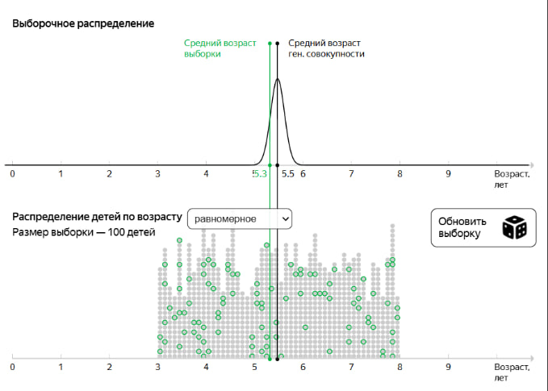

Стандартная ошибка — это стандартное отклонение (разброс) выборочного распределения статистики в ГС:

```
SE = σ / √n
```

где σ — стандартное отклонение ГС, σ2 — дисперсия ГС, n — размер выборки.

Если мы не знаем\не можем посчитать дисперсию ГС, можно использовать другую формулу — по дисперсии выборки.

Оцененная стандартная ошибка — оценка стандартной ошибки по выборке.

```
ESE = s / √n
```

где S — стандартное отклонение выборки (σ), σ2 — дисперсия выборки, n — размер выборки

Кратко:
- ЦПТ гарантирует, что выборочные средние будут распределены нормально
- ESE — оценивает стандартное отклонение этого распределения по выборке

## ГИПОТЕЗЫ

Гипотеза — предположение о данных. Фундаментальное ограничение: гипотезу можно только опровергнуть или не опровергнуть; но нет оснований утверждать, что выдвинутая гипотеза доказана.

Биологи изучают маршруты перелетов птиц редкого вида. Гипотеза в том, что они всегда летят вдоль рек. Учёные отловили случайным образом несколько десятков птиц, прикрепили датчики и отпустили. Все отслеженные маршруты оказались пролегающими вдоль рек.  
Доказывает ли это гипотезу? Нет, потому что какие-то птицы, возможно, летают по-другому, а отследить маршруты всех птиц даже редкого вида чаще всего невозможно. Однако уверенность в том, что гипотеза верна, повысилась.

Нулевая гипотеза H0 обычно формулируется через знак =.  
Альтернативная гипотеза H1 должна противоречить H0 (принимается верной, если отбрасывается H0).

Пример.

```
H0: Среднее генеральной совокупности равно A
H1: Среднее генеральной совокупности не равно A
```

Общая логика проверки гипотез.
1. Формулируем нулевую H0 и альтернативную H1 гипотезы
2. По ЦПТ выборочные средние распределены нормально вокруг истинного среднего с разбросом ESE (для выборки).
3. Тогда, если гипотеза H0 верна, центром распределения будет A. Строим распределение с центром A и шириной ESE.
4. Получаем выборочное среднее нашей выборки и смотрим, где оно находится в распределении, построенном выше:
   - если оно в районе центра — нулевую гипотезу не отвергаем
   - если оно далеко от центра — нулевую гипотезу отвергаем и принимаем альтернативную

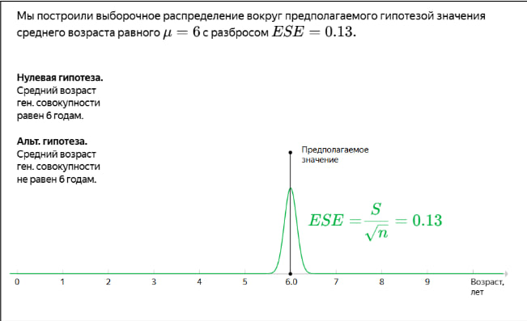
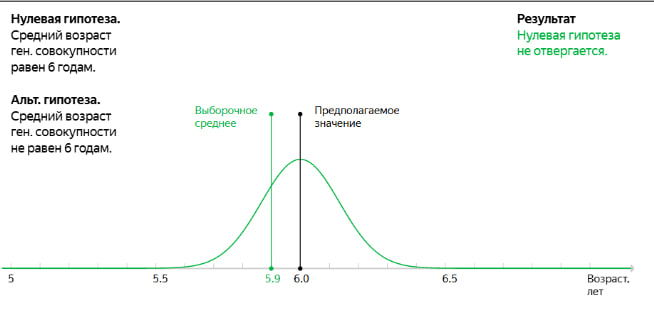
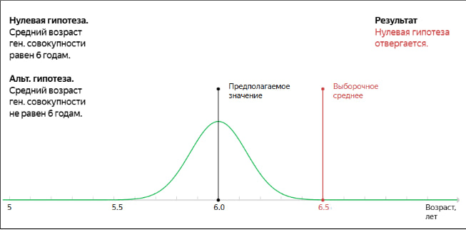

## СТАТ ЗНАЧИМОСТЬ

Уровень значимости численно задает границы — когда мы считаем, что выборочное среднее далеко от предполагаемого, а когда нет.  
Если выборочное среднее попало в границы, мы не отвергаем нулевую гипотезу.  
Если не попало — отвергаем нулевую и принимаем альтернативную гипотезу.

Конвенциональные значения значимости — 1% и 5%.

Увеличить уровень статистической значимости → границы интервала станут меньше  
Уменьшить уровень статистической значимости → границы интервала станут больше

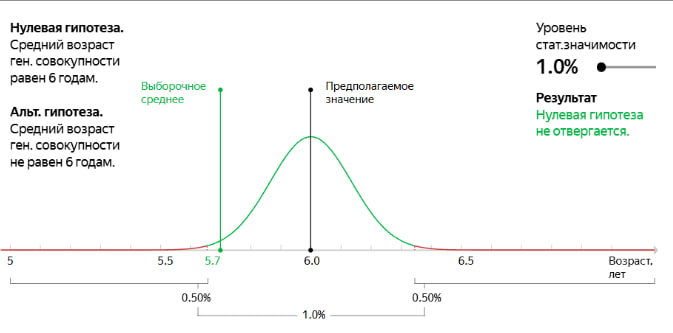
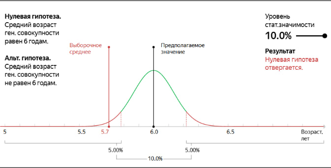

Если у вас односторонняя гипотеза, то граница будет одна.

Пример.

```
H0: Число посетителей в месяц равно 50 тыс.
H1: Число посетителей в месяц стало больше 50 тыс.
```

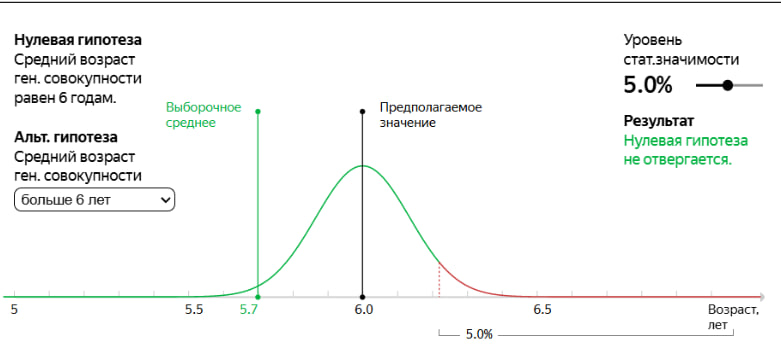
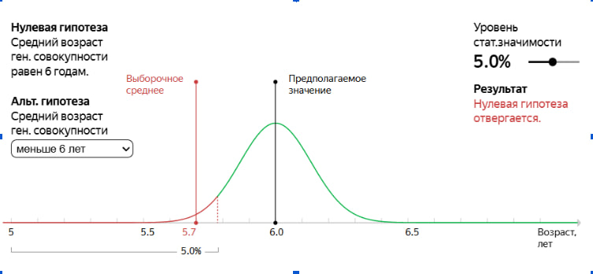

## P-VALUE

P-value — вероятность при верной нулевой гипотезе получить наблюдаемое значение или более удалённое от того, которое предположили в H0.

P-value равно площади под графиком от наблюдаемого значения (выборочного среднего) до бесконечности.

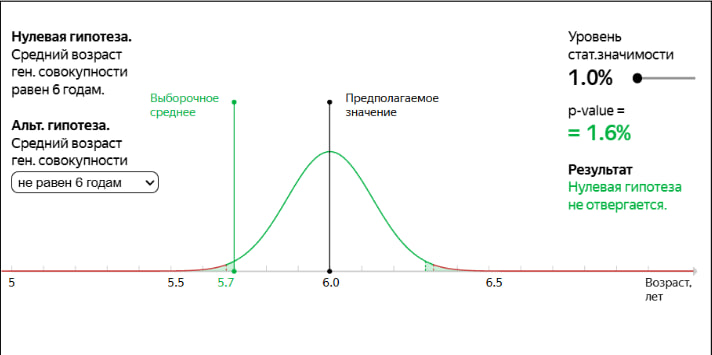

Уровень статистической значимости выбираем перед проведением статистического теста.  
p-value считаем для конкретно взятой выборки.

Если p-value < статистической значимости → то нулевая гипотеза отвергается в пользу альтернативной.

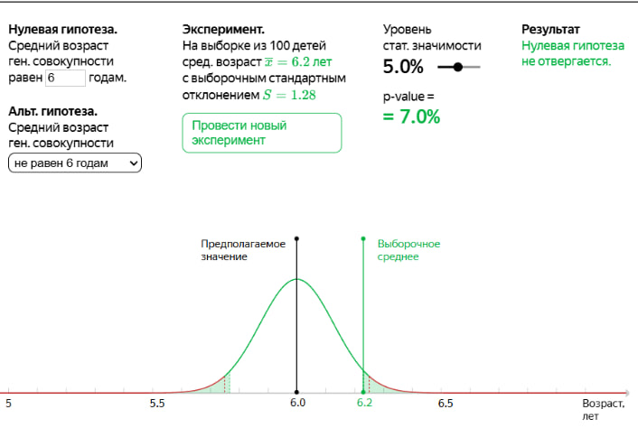

## T-ТЕСТ

Если эмпирических значений немного (не больше 20-30), то распределение H0 будет немного шире нормального. Больший разброс объясняется недостатком данных. В таком случае используется t-распределение Стьюдента — при большой выборке t-распределение приближается к нормальному.

Статистический тест с использованием t-распределения называется t-тестом.

Как понять, можно ли применять t-тест:
- Для тестов, кроме парного: ГС не должны зависеть друг от друга.
- Если рассматривать одну ГС до и после какого-то изменения, нужно использовать парный тест на проверку гипотез зависимых ГС.
- Выборочные средние должны быть нормально распределены.

Напоминание: благодаря ЦПТ, если размер выборки составляет хотя бы несколько десятков значений, выборочные средние, которые можно получить из одной и той же ГС, будут распределены нормально вокруг истинного среднего этой совокупности. Это утверждение верно, даже если сама генеральная совокупность не распределена нормально.

Для классического t-теста на сравнение двух ГС: их дисперсии должны быть равны.

Вы никогда точно не знаете, равны ли дисперсии рассматриваемых ГС. Если выборки достаточно велики (30 и больше значений) и равны по размеру между собой, при equal_var = True тест скорее всего не ошибется.

## КОД PYTHON

В блоке:
- Двусторонний гипотезы
- Односторонние гипотезы
- Гипотезы сравнения двух независимых ГС
- Гипотезы сравнения двух зависимых ГС (например, ГС до и после)

### Двусторонние и односторонние гипотезы

Метод Питон `scipy.stats.ttest_1samp(array, popmean)` возвращает два числа: статистику разности и p-value. По умолчанию p-value возвращается двусторонней — то есть мы проверяем гипотезы формата равно\не равно.

В названии метода: ttest — t-тест, 1samp — работа с одной выборкой.

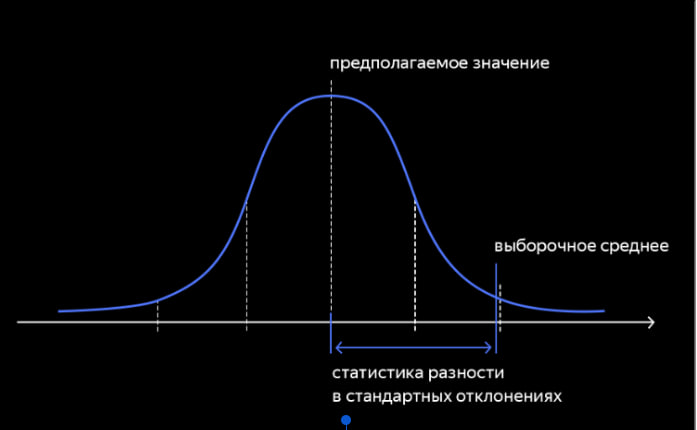
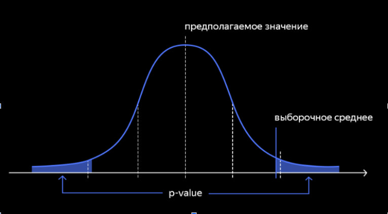

Параметры:
- array — массив, содержащий выборку (датафрейм);
- popmean — предполагаемое среднее, на равенство которому делают тест.

Отличие двухсторонней и односторонней гипотезы с уровнем значимости 5%.

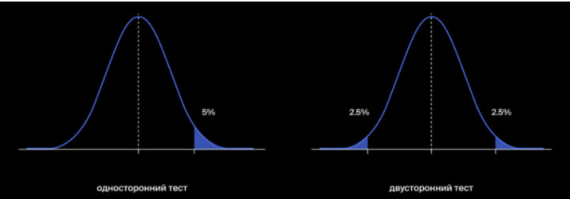

### Двусторонние гипотезы

Пример кода

Нулевая гипотеза H0: Пользователи проводят на сайте 2 часа в день  
Альтернативная гипотеза H1: Пользователи не проводят на сайте 2 часа в день

```python
#Библиотеки
from scipy import stats as st
import numpy as np
import pandas as pd

#Параметры
time_at_site = pd.read_csv('/datasets/user_time.csv')
interested_value = 120 # столько времени должны проводить пользователи на сайте
alpha = .05 # критический уровень статистической значимости 5%

#Проверка гипотезы
results = st.ttest_1samp(time_at_site, interested_value)

print('p-значение:', results.pvalue)

if results.pvalue < alpha:
    print("Отвергаем нулевую гипотезу")
else:
    print("Не получилось отвергнуть нулевую гипотезу")

#Ответ
p-значение:  [0.27702871]
Не получилось отвергнуть нулевую гипотезу
```

### Односторонние гипотезы

Для проведения одностороннего теста p-value двустороннего места `scipy.stats.ttest_1samp()` делим пополам.  
Также добавляем условие на проверку больше\равно — чтобы задать, с какую сторону ждем отклонение. Например, альтернативная гипотеза, что среднее стало меньше — помимо проверки p-value надо проверить, что выборочное среднее меньше предполагаемого значения.

Пример кода

Нулевая гипотеза H0: Среднее количество просмотренных блоков после изменения дизайна осталось прежним.  
Альтернативная гипотеза H1: Среднее количество просмотренных блоков после изменения дизайна уменьшилось.

```python
#Библиотеки
from scipy import stats as st
import pandas as pd

#Параметры
screens = pd.Series([4, 2, 4…]) # выборка с числом просмотренных блоков
prev_screens_value = 4.867 # прошлое среднее просмотров 
alpha = .05 # уровень статистической значимости 5%

#Проверка гипотезы
results = st.ttest_1samp(screens, prev_screens_value)

print('p-значение:', results.pvalue / 2)# тест односторонний: p-value будет в два раза меньше

if (results.pvalue / 2 < alpha) and (screens.mean() < prev_screens_value):
# тест односторонний влево:
# отвергаем гипотезу только тогда, когда выборочное среднее значимо меньше предполагаемого значения
    print("Отвергаем нулевую гипотезу")
else:
    print("Не отвергаем нулевую гипотезу")

#Ответ
p-значение:  1.3358596895543794e-06
Отвергаем нулевую гипотезу
```

### Гипотезы равенства двух независимых ГС

Метод Питон `scipy.stats.ttest_ind(array1, array2, equal_var)`.

Параметры:
- array1, array2 — массивы, содержащие выборки (датафреймы);
- equal_var — считать ли равными дисперсии выборок, необязательный параметр. По умолчанию True. Ставим False, если массивы имеют очень разную размерность\очень малы.

Пример кода

Нулевая гипотеза H0: Средняя сумма покупок, которые были совершены за месяц посетителями, привлеченным по двум разным каналам, равна  
Альтернативная гипотеза H1: Средняя сумма покупок, которые были совершены за месяц посетителями, привлеченным по двум разным каналам, не равна.

```python
#Библиотеки
from scipy import stats as st
import numpy as np

#Параметры
sample_1 = [3071, 3636, …] #выборка ГС 1
sample_2 = [1211, 1228, …] #выборка ГС 2
alpha = 0.05 # уровень статистической значимости 5%

#Проверка гипотезы
results = st.ttest_ind(sample_1, sample_2)

print('p-значение:', results.pvalue)# если p-value меньше него стат значимости, отвергнем гипотезу

if results.pvalue < alpha:
    print('Отвергаем нулевую гипотезу')
else:
    print('Не получилось отвергнуть нулевую гипотезу')

#Ответ
#вероятность случайно получить такое или большее различие равна почти 20%. Это слишком большая вероятность, чтобы делать вывод о значимом различии между средними чеками
p-значение:  0.1912450522572209 
Не получилось отвергнуть нулевую гипотезу
```

### Гипотезы равенства двух независимых ГС

Метод Питон `scipy.stats.ttest_rel(before, after)`

Параметры:
- before — выборка до изменений;
- after — выборка после изменений

Пример кода

Нулевая гипотеза H0: Вес посылок не изменился после изменения способа расчета оплаты доставки.  
Альтернативная гипотеза H1: Вес посылок изменился после изменения способа расчета оплаты доставки.

```python
#Библиотеки
from scipy import stats as st
import numpy as np

#Параметры
before = [157, 114, …] #выборка ГС до
after = [282, 220, …] #выборка ГС после
alpha = 0.05 # уровень статистической значимости 5%

#Проверка гипотезы
results = st.ttest_rel(before, after)

print('p-значение:', results.pvalue)# если p-value меньше него стат значимости, отвергнем гипотезу

if results.pvalue < alpha:
    print('Отвергаем нулевую гипотезу')
else:
    print('Не получилось отвергнуть нулевую гипотезу')

#Ответ
p-значение:  0.005825972457958989
Отвергаем нулевую гипотезу
```
